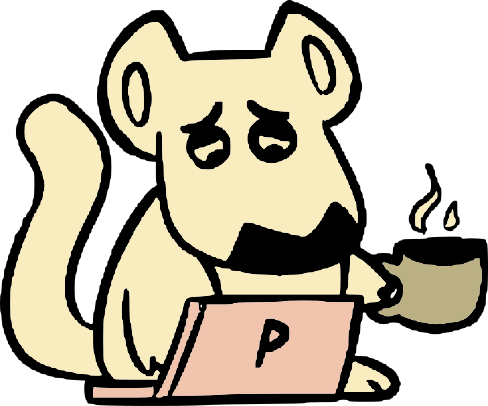

<h1 align="center">P.U.M.A - Plataforma Unificada de Materiais Acadêmicos</h2>

    
     
    

# 
> 📰 **NOVIDADES:** Links para os drives de envio das atividades dos professores! 
>
> 🚧 **Status do Projeto:** Em andamento 
> 
>     https://projetopuma.github.io/PUMA/

## 🎯 Proposta 
Disponibilizar uma plataforma para os alunos do curso de ADS da Fatec. Seu foco principal é unificar as diferentes demandas que surgem ao longo do semestre, que outrora deveriam ser acessadas em aplicativos diferentes, como: atividades, tarefas, provas, material de ensino, documentos da faculdade e horários.

A iniciativa surgiu pela ausência de uma plataforma arquitetada para os alunos que priorizasse mantê-los ativos e atentos sobre sua vida escolar de forma rápida e prática. 

 

## 🎥 Telas do Site  

 

## 💻 Tecnologias Utilizadas 
<h4 align="center">
  
  
  
  
  
</h4>

 

## 🎓 Colaboradores 

  <table>
    <tr>
      <th>Membro</th>
      <th>Função</th>
      <th>Github</th>
      <th>Linkedin</th>
    </tr>
   
   <tr>
      <td>Adler Rocha</td>
      <td>Desenvolvedor</td>
      <td></td>
      <td></td>
    </tr>
    <tr>
      <td>Taís Souza</td>
      <td>Desenvolvedora</td>
      <td></td>
      <td></td>
    </tr>
  </table>

